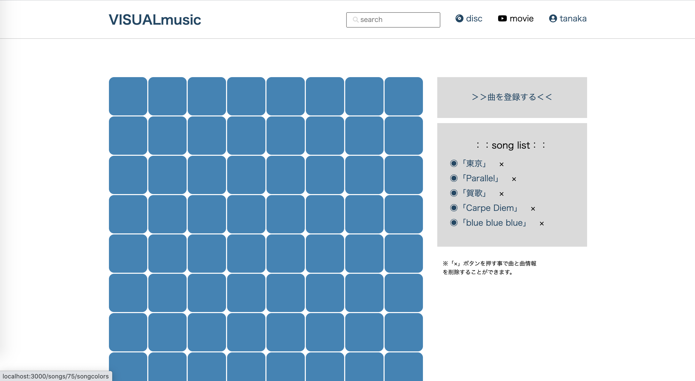

# README
<!-- 
This README would normally document whatever steps are necessary to get the
application up and running.

Things you may want to cover:

* Ruby version

* System dependencies

* Configuration

* Database creation

* Database initialization

* How to run the test suite

* Services (job queues, cache servers, search engines, etc.)

* Deployment instructions

* ... -->

## アプリ名 

「visual music」

## サイトのイメージ
  
  
  
## 🌐 App URL
  
[visual music](https://visualmusicc.herokuapp.com/)  
  
＊テスト用ログインユーザー＊  
ユーザー名/tanaka  
パスワード/１２３４５６７８  
  
新規登録もできますがこちらをご利用いただけますと幸いです。  
  
  
## 概要
  
音楽を聞いた感想を色に例えて投稿。  
他のリスナーと曲のイメージカラーなどを共有して音楽を楽しむアプリ。  
  
## 使用方法 and DEMO
  
①上記のテスト用ユーザーでログイン  
（ログインできない時は新規でご登録ください。）  
  
②曲名をと登録  
  
  
③登録した曲名をクリックし、イメージカラーを登録できる。  
  
  
  
  
## 課題や今後実装したい機能
  
少しの言葉を添付して投稿できるようにする。  
曲をCDと紐付けて利用可能にする。  
関連動画を設定できるようにする。  
得意とするイラストをアプリに活用する。  
ロゴデザインをして配置。  
曲のサーチ機能。  
  
  
## 工夫したポイント
  
＊メインとなる機能が配置されているフロントのデザインを中央に持ってくる事によって、ブラウザをすっきりと見せた。  
  
＊メイン機能をコメントの投稿ではなく視覚的で感覚的なカラーの投稿にする事でユーザー同士が自分で解釈できるように考えた。  
（カラーピッカーの実装で可能になった。）  
  
## 使用技術(開発環境)
  
VSCode,HTML/CSS, Ruby, Ruby on Rails  
  
  
# DB設計

## songcolorsテーブル

|Column|Type|Options|
|------|----|-------|
|color|integer|null: false|
|colorTitle|string|null: false|
|comment|text|null: true|
|user_id|references|null: false, foreign_key: true|
|song_id|references|null: false, foreign_key: true|

### Association
- belongs_to :songs
- belongs_to :users

## usersテーブル

|Column|Type|Options|
|------|----|-------|
|name|string|null: false|
|email|string|null: false|
|password|string|null: false|
|song_id|references ||

### Association
- has_many :images
- has_many :users_songs
- has_many :songs, through: :users_songs

## users_songsテーブル

|Column|Type|Options|
|------|----|-------|
|user_id|references||
|song_id|references||

### Association
- belongs_to :users
- belongs_to :songs

## songsテーブル

|Column|Type|Options|
|------|----|-------|
|name|string|null: false|

### Association
- has_many :images
- has_many :users_songs
- has_many :users, through: :users_songs
- has_many :songs_discs
- has_many :discs, through: :songs_discs

## songs_discsテーブル

|Column|Type|Options|
|------|----|-------|
|song_id|references||
|disc_id|references||

### Association
- belongs_to :songs
- belongs_to :disc

## discsテーブル

|Column|Type|Options|
|------|----|-------|
|disc|string|null: false|

### Association 
- has_many :songs_discs
- has_many :songs, through: :songs_discs
